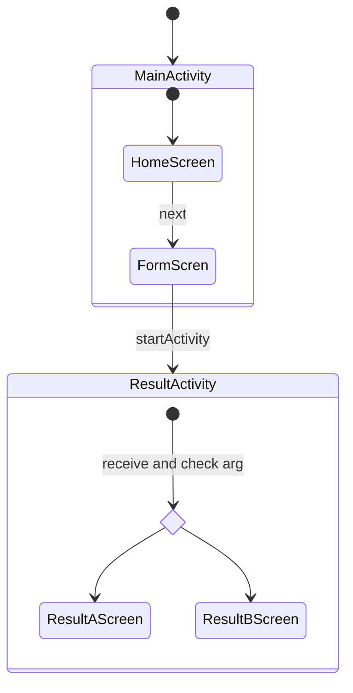

# compose-navigation-sample

Compose Navigation を利用した画面遷移おいて、`NavHost`のstartDestinationで指定した最初の画面に引数を渡すサンプルアプリ

### 画面構成

### 動作イメージ

https://github.com/Seo-4d696b75/compose-navigation-sample/assets/25225028/980c6d37-580b-4d64-bca8-d52d5abd31f2

